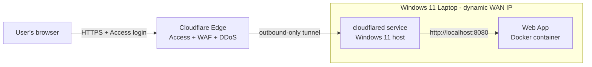

# Secure Remote Access to a Local Web App via Cloudflare Tunnel — Windows 11


Publish a containerized web application running on a Windows 11 host to the public Internet — **without opening router ports, buying a static IP, or exposing the machine** — and put an **email-based Zero Trust login** in front of it.

The host is a mobile laptop that changes networks frequently (home Wi‑Fi, office, phone tethering). Because the connector uses an **outbound-only** connection to Cloudflare's edge, the public URL stays reachable regardless of the local WAN IP, and reconnects automatically whenever the network changes.

---

## Table of Contents

- [Architecture](#architecture)
- [How it solves the dynamic-IP problem](#how-it-solves-the-dynamic-ip-problem)
- [Prerequisites](#prerequisites)
- [Part 1 — Cloudflare: create the tunnel](#part-1--cloudflare-create-the-tunnel)
- [Part 2 — Windows 11: install the connector as a service](#part-2--windows-11-install-the-connector-as-a-service)
- [Part 3 — Publish the application route](#part-3--publish-the-application-route)
- [Part 4 — Access control (email one-time PIN)](#part-4--access-control-email-one-time-pin)
- [Part 5 — Harden: enforce Access JWT validation](#part-5--harden-enforce-access-jwt-validation)
- [Part 6 — Resilience: survive network changes and sleep](#part-6--resilience-survive-network-changes-and-sleep)
- [Verification](#verification)
- [Troubleshooting](#troubleshooting)
- [Security model](#security-model)
- [License](#license)

---

## Architecture



Request flow:

1. A user opens `https://app.example.com`.
2. Cloudflare intercepts the request at the edge and enforces the **Access** policy (email OTP). Unauthorized users never reach the origin.
3. Authorized requests are forwarded down the **outbound-only tunnel** to `cloudflared` on the Windows host.
4. `cloudflared` proxies the request to the container listening on `localhost:8080`.

No inbound ports are opened on the router or the host. The only exposed surface is the single published hostname, gated by Access.

---

## How it solves the dynamic-IP problem

Traditional remote access requires a static public IP and inbound port-forwarding — impractical for a laptop that roams between networks. Cloudflare Tunnel inverts the model:

- `cloudflared` opens a **persistent outbound connection** from the host to Cloudflare.
- Inbound traffic rides back down that existing connection.
- When the network changes (new Wi‑Fi, tethering, different WAN IP), the connector detects the drop and **re-establishes the outbound connection automatically**.

The public hostname never changes. The local IP is irrelevant.

---

## Prerequisites

| Requirement | Notes |
|---|---|
| A domain on Cloudflare | Nameservers pointing to Cloudflare (free plan is sufficient). Required for Access. |
| Cloudflare Zero Trust enabled | Free tier. Dashboard: `one.dash.cloudflare.com`. |
| Docker Desktop for Windows | The web app runs in a container publishing port `8080`. |
| Windows 11 host | Admin rights (PowerShell as Administrator) to install the service. |
| The app reachable locally | `curl http://localhost:8080` returns the app on the host. |

> **Security note:** the tunnel **token** grants control over the connector. Treat it like a secret. **Never commit it to a repository, screenshot it publicly, or paste it in issues.** This document uses `<YOUR_TUNNEL_TOKEN>` as a placeholder throughout.

---

## Part 1 — Cloudflare: create the tunnel

1. Go to **`one.dash.cloudflare.com`** → **Networks → Tunnels → Create a tunnel**.
2. Select **Cloudflared** as the connector type.
3. Name the tunnel (e.g. `windows-webapp`) and save.
4. On the **Install and run a connector** screen, Cloudflare displays install commands containing the **tunnel token** (a long string starting with `eyJ...`).

**Copy the token now and store it in a password manager.** It is fixed for the life of the tunnel and works on any network. You can retrieve it later via the tunnel's **Configure** page or rotate it with **Refresh token**.

---

## Part 2 — Windows 11: install the connector as a service

Installing `cloudflared` as a **Windows service** is what makes the tunnel survive reboots, sleep, and network changes. Running it in an interactive terminal (`cloudflared tunnel run`) is **not** persistent and will drop on network change — do not use that mode for hosting.

### 2.1 Install cloudflared

Open **PowerShell as Administrator** and install via winget:

```powershell
winget install --id Cloudflare.cloudflared
```

Close and reopen PowerShell (as Administrator) so the new `PATH` is picked up, then verify:

```powershell
cloudflared --version
```

### 2.2 Register the service with your token

```powershell
cloudflared service install <YOUR_TUNNEL_TOKEN>
```

This registers a Windows service that starts on boot and auto-reconnects.

### 2.3 Confirm the service is running

```powershell
Get-Service cloudflared
```

`Status` should read `Running`. In the Cloudflare dashboard, the tunnel should show **Healthy** and the connector **Connected**.

> **If reinstalling:** remove any previous service first with `cloudflared service uninstall` (ignore the error if none exists), then run `service install` again.

> **Docker networking note:** with `cloudflared` installed **natively** on Windows (as above), `localhost:8080` resolves correctly to the container's published port. If you instead run `cloudflared` **inside a container**, `localhost` refers to that container — use `http://host.docker.internal:8080` as the service target instead.

---

## Part 3 — Publish the application route

1. Open the tunnel → **Published application routes** tab → **Add a published application route**.
2. Configure:

| Field | Value |
|---|---|
| **Subdomain** | `app` (or your choice) |
| **Domain** | your Cloudflare domain |
| **Path** | *(leave empty)* |
| **Type** | `HTTP` |
| **URL** | `localhost:8080` |

3. Save. Cloudflare creates the proxied `CNAME` DNS record automatically.

> **Common mistake:** `localhost:8080` belongs **only** in the **URL** field under *Service*. Do not enter it in **Path**, **Proxy Type**, or **HTTP Host Header** — doing so produces a `404` (the catch-all `http_status:404` rule takes over). Leave those fields empty. `Path` empty means "match all paths".

Test in a private/incognito window:

```
https://app.example.com/
```

If the app loads, proceed. If you get `502`, the tunnel reached the host but the container did not respond — verify `curl http://localhost:8080` on the host.

---

## Part 4 — Access control (email one-time PIN)

Gate the application so only authorized emails can reach it.

1. Zero Trust → **Access → Applications → Add an application → Self-hosted**.
2. **Application domain:** `app.example.com` (the same hostname).
3. Go to **Policies → Add a policy**:
   - **Policy name:** `Authorized emails`
   - **Action:** `Allow`
   - **Include → Emails:** add each authorized address.
4. Save the application.

**One-Time PIN** is the default, always-on login method for every Zero Trust account — no extra configuration is required. It cannot be disabled or removed.

Result: visitors are challenged with a Cloudflare login screen, enter their email, receive a single-use code, and are admitted only if their address is on the allow-list.

---

## Part 5 — Harden: enforce Access JWT validation

Without this, a party who discovers the tunnel URL could theoretically bypass Access by reaching the origin directly. Enabling **JWT validation** makes `cloudflared` reject any request that does not carry a valid Access token — making Access mandatory.

> Enable this **only after** the email login is confirmed working. Enabling it prematurely locks you out.

1. Tunnel → **Published application routes** → edit the route (`...` menu).
2. Open **Origin request and connection settings**.
3. Set **Enforce Access JWT validation** → **On**.
4. In the **Application** selector, choose the Access application created in Part 4.
5. Save.

---

## Part 6 — Resilience: survive network changes and sleep

The service handles reconnection on network change automatically. Two host-level settings make the deployment fully autonomous.

### 6.1 Keep the container running

Ensure the app restarts on its own after Docker or the host restarts:

```powershell
docker update --restart unless-stopped <CONTAINER_NAME>
```

Or in `docker-compose.yml`:

```yaml
services:
  webapp:
    restart: unless-stopped
    ports:
      - "8080:8080"
```

### 6.2 Prevent the laptop from sleeping while hosting

If the machine suspends, both `cloudflared` and Docker pause. For a hosting laptop, disable sleep (PowerShell as Administrator):

```powershell
# Never sleep on AC or battery
powercfg /change standby-timeout-ac 0
powercfg /change standby-timeout-dc 0
```

To keep hosting with the lid closed, set the lid-close action to "Do nothing":

```powershell
# 0 = Do nothing
powercfg /setacvalueindex SCHEME_CURRENT SUB_BUTTONS LIDACTION 0
powercfg /setdcvalueindex SCHEME_CURRENT SUB_BUTTONS LIDACTION 0
powercfg /setactive SCHEME_CURRENT
```

> Alternatively, configure these under **Settings → System → Power** and **Control Panel → Power Options → Choose what closing the lid does**.

---

## Verification

| Check | Command / Action | Expected |
|---|---|---|
| Service running | `Get-Service cloudflared` | `Status: Running` |
| Tunnel healthy | Dashboard → Tunnels | `Healthy` / `Connected` |
| App reachable locally | `curl http://localhost:8080` | App HTML |
| Public access + login | Open `https://app.example.com` in incognito | Access email prompt → app |
| Survives network change | Switch Wi‑Fi ↔ tethering, wait ~30s, reload | App reachable again |

---

## Troubleshooting

| Symptom | Likely cause | Fix |
|---|---|---|
| `HTTP ERROR 404` | `localhost:8080` placed in **Path** / **Proxy Type** instead of **URL** | Clear those fields; keep the value only in Service → URL |
| `502` / `521` | Container not answering on 8080 | Verify `curl http://localhost:8080`; check `--restart unless-stopped` |
| `530` / DNS not resolving | Missing or grey-clouded CNAME | Confirm the record is **proxied** in DNS |
| Drops on network change | Running `cloudflared tunnel run` in a terminal (not a service) | Stop it; run `cloudflared service install <TOKEN>` |
| App loads but broken (CSS/JS) | App validates the `Host` header | Set **HTTP Host Header** = `localhost:8080` in Origin settings |
| Service won't install | Stale prior service | `cloudflared service uninstall`, then reinstall |

Inspect service logs via **Event Viewer → Windows Logs → Application** (source `cloudflared`), or run `cloudflared tunnel info <tunnel-name>`.

---

## Security model

**What is protected**

- The tunnel forwards traffic **only** to the routes you define. The single route (`localhost:8080`) plus the `http_status:404` catch-all means no other port, service, or file on the host is reachable through the tunnel. It is not a general "open door" to the machine.
- **No inbound ports** are exposed on the router or host — an external scan of the WAN IP sees nothing.
- **Cloudflare Access** enforces email OTP before any request reaches the origin.
- **JWT validation** (Part 5) makes Access non-bypassable.

**What still requires care** — the residual risk is not the tunnel exposing the host; it is what lives *behind* port 8080:

1. **The application itself.** Authenticated users have full access to whatever the app on 8080 offers. If the app can read/write arbitrary files or run commands, that capability is reachable. Review the app's own surface.
2. **The allow-list.** Everyone on the Access email list has real access. Keep it minimal and trusted.
3. **The token.** Anyone with the tunnel token can run a connector for this tunnel. Store it in a secret manager; rotate via **Refresh token** if exposed.

In short: the operating system, files, and other ports remain protected — the tunnel exposes only port 8080. Operational security reduces to keeping the Access list trusted, enforcing JWT validation, protecting the token, and trusting the published application.

---

## License

MIT — see [`LICENSE`](LICENSE).

## Author

Documented and deployed by **Gustavo Carvalho** — Infrastructure & Cloud Operations.
